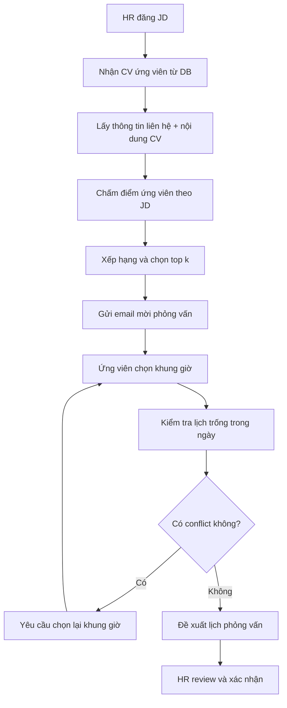

# PLAN.md - Đề tài 9: Trợ Lý Sàng Lọc Hồ Sơ Tuyển Dụng & Hẹn Phỏng Vấn

## 1. Mục tiêu demo

Demo này mô phỏng một trợ lý tuyển dụng dùng AI để tự động hóa 3 việc cốt lõi: đọc CV ứng viên, chấm điểm mức độ phù hợp với JD, và hỗ trợ đặt lịch phỏng vấn cho những ứng viên vượt qua vòng lọc hồ sơ.

Mục tiêu của demo không phải thay thế HR, mà là giảm tải thao tác thủ công, tăng tốc độ sàng lọc, và chuẩn hóa bước mời phỏng vấn theo quy trình nhất quán.

## 2. Vì sao bài toán cần AI

### Question 1: Vì sao cần AI?

- Số lượng CV ứng viên có thể rất lớn, trong khi HR chỉ có thời gian hữu hạn để đọc thủ công.
- CV thường không đồng nhất về định dạng, cách trình bày, và mức độ đầy đủ thông tin.
- Nhiều JD yêu cầu đối chiếu đồng thời kinh nghiệm, kỹ năng, học vấn, chứng chỉ, và mức độ phù hợp tổng thể.
- Nếu chỉ dùng rule-based keyword matching, hệ thống dễ bỏ sót ứng viên tốt hoặc ưu tiên nhầm ứng viên do từ khóa trùng nhưng ngữ cảnh không phù hợp.

### Question 2: AI làm gì?

- Đọc thông tin ứng viên đã lưu trong database và trích xuất các tín hiệu liên quan: kinh nghiệm, kỹ năng, dự án, học vấn, chứng chỉ, mức độ phù hợp với JD.
- Chấm điểm ứng viên theo rubric chuẩn hóa, có giải thích ngắn gọn vì sao điểm cao hoặc thấp.
- Sắp xếp ứng viên theo điểm và chọn top k theo số lượng cần tuyển hoặc ngưỡng tuyển dụng.
- Gửi thông báo cho ứng viên vượt qua vòng lọc, yêu cầu chọn khung giờ phỏng vấn qua email.
- Nhận phản hồi thời gian từ ứng viên, đối chiếu lịch còn trống của công ty, và đề xuất lịch phỏng vấn phù hợp cho HR review.

## 3. Phạm vi demo

### In-scope

- HR đăng JD mới vào hệ thống.
- Ứng viên nộp CV qua form/email hoặc dữ liệu giả lập trong database.
- Agent đọc CV, lấy thông tin liên hệ, chấm điểm, và lọc top k ứng viên.
- Agent gửi email mời phỏng vấn cho ứng viên đạt điểm.
- Agent thu thập khung giờ ứng viên có thể tham gia và đề xuất lịch phù hợp với lịch trống của công ty.
- HR xem danh sách đề xuất và xác nhận lịch phỏng vấn cuối cùng.

### Out-of-scope

- Không xử lý legal screening, background check, hoặc quyết định tuyển dụng cuối cùng.
- Không tự động gửi offer letter.
- Không thay thế quy trình HR phê duyệt cuối cùng.
- Không dùng dữ liệu nhạy cảm ngoài phạm vi demo nếu chưa có ủy quyền rõ ràng.

## 4. Workflow demo cơ bản

### Luồng chính

1. HR đăng JD.
2. Hệ thống nhận CV ứng viên từ database.
3. Agent lấy thông tin liên hệ và nội dung CV.
4. Agent chấm điểm từng ứng viên theo JD.
5. Agent xếp hạng và chọn top k ứng viên dựa trên số lượng cần tuyển.
6. Agent gửi email mời phỏng vấn cho ứng viên vượt chuẩn.
7. Ứng viên phản hồi khung giờ có thể tham gia.
8. Agent kiểm tra lịch trống trong ngày và xếp lịch phỏng vấn theo khung giờ phù hợp.
9. HR review danh sách lịch đề xuất và xác nhận.

### Logic quyết định

- Nếu câu hỏi đơn giản như tra cứu trạng thái, chatbot baseline có thể trả lời nhanh.
- Nếu câu hỏi yêu cầu đọc CV, đối chiếu JD, chấm điểm, gửi email, và xử lý lịch, hệ thống đi theo ReAct Agent path.

## 5. Thiết kế kiến trúc ứng dụng agent

### Design pattern

- ReAct Agent là pattern chính để demo vì bài toán có nhiều bước, cần gọi tool, và cần quan sát kết quả từng bước.
- LangGraph là lớp điều phối luồng để biểu diễn các node rõ ràng: intake, scoring, ranking, outreach, scheduling, HR review.
- Python là ngôn ngữ triển khai để demo nhanh, dễ tích hợp API, email, database, và logic đánh giá.

### Model đề xuất

- Mặc định chọn gpt-4o-mini nếu ưu tiên chất lượng hướng dẫn, tool-use ổn định, và cấu trúc đầu ra tốt cho demo.
- Nếu môi trường đang dùng hệ sinh thái Google hoặc cần tối ưu chi phí thấp hơn, có thể thay bằng gemini-2.5-flash-lite.
- Thiết kế abstraction để model có thể thay thế mà không ảnh hưởng logic nghiệp vụ.

### Kiến trúc module

- Ingestion layer: nhận JD và CV từ form, file upload, hoặc database giả lập.
- Retrieval layer: đọc hồ sơ ứng viên và thông tin lịch trống.
- Scoring layer: chấm điểm ứng viên theo rubric chuẩn.
- Ranking layer: chọn top k ứng viên theo nhu cầu tuyển dụng.
- Outreach layer: gửi email mời phỏng vấn và nhận phản hồi khung giờ.
- Scheduling layer: đối chiếu khung giờ ứng viên với lịch công ty.
- Review layer: HR xác nhận lịch cuối cùng.
- Observability layer: log toàn bộ thought/action/observation, score, tool calls, email status, và quyết định xếp lịch.

## 6. Danh sách tools cho demo

### Tool 1: Lấy thông tin ứng viên

- Input: candidate_id hoặc email.
- Output: hồ sơ ứng viên, email, số điện thoại, kinh nghiệm, kỹ năng, dự án, học vấn, và metadata.
- Vai trò: cung cấp dữ liệu đầu vào đáng tin cậy cho bước chấm điểm.

### Tool 2: Chấm điểm ứng viên

- Input: candidate_profile, jd_text, scoring rubric.
- Output: điểm tổng, điểm theo tiêu chí, và short rationale.
- Vai trò: giúp agent tạo quyết định có căn cứ, không chỉ dựa vào cảm tính.

### Tool 3: Lấy lịch trong ngày và xếp lịch phỏng vấn

- Input: danh sách khung giờ ứng viên chọn, lịch trống của công ty, thời lượng phỏng vấn.
- Output: slot đề xuất, trạng thái conflict/available, và lịch đã chốt nếu hợp lệ.
- Vai trò: tối ưu hóa việc sắp lịch và tránh overlap.

### Tool 4: Gửi email

- Input: recipient, subject, body, template type.
- Output: message_id, delivery status, và timestamp.
- Vai trò: thông báo cho ứng viên và HR một cách có trace.

## 7. Few-shot examples cho phần chấm điểm

### Mục tiêu của few-shot

- Giúp model hiểu cách rubric được áp dụng nhất quán.
- Giảm việc chấm điểm quá rộng hoặc quá cảm tính.
- Ép model trả về kết quả có cấu trúc, dễ kiểm tra.

### Ví dụ rubric đề xuất

- Kinh nghiệm đúng ngành: 0 đến 5 điểm.
- Kỹ năng cứng phù hợp JD: 0 đến 5 điểm.
- Kỹ năng mềm và giao tiếp: 0 đến 3 điểm.
- Học vấn/chứng chỉ liên quan: 0 đến 2 điểm.
- Tổng điểm: 15 điểm.

### Few-shot format mẫu

- Input: JD yêu cầu Python, SQL, dashboard, 2 năm kinh nghiệm.
- CV mẫu A: 3 năm Python, SQL, BI dashboard, từng làm product analytics.
- Expected: điểm cao, có lý do rõ ràng vì match cả kỹ năng và kinh nghiệm.

- Input: JD yêu cầu data analyst, Python, SQL, stakeholder communication.
- CV mẫu B: Java backend, không có SQL, không có analytics.
- Expected: điểm thấp, loại do lệch chuyên môn.

### Output format mong muốn

- score_total
- score_breakdown
- pass_or_fail
- explanation_short

## 8. Guardrails

### Guardrail 1: Bảo vệ dữ liệu cá nhân

- Không để agent tiết lộ dữ liệu cá nhân của ứng viên cho người không có quyền.
- Khi trả lời, chỉ dùng thông tin cần thiết cho mục tiêu tuyển dụng.
- Ẩn hoặc mask các trường nhạy cảm nếu không cần thiết cho bước hiện tại.

### Guardrail 2: Giới hạn thông tin ngoài chuyên môn

- Không suy luận hoặc tiết lộ thông tin cá nhân ngoài phạm vi công việc như tình trạng sức khỏe, đời sống riêng tư, tôn giáo, quan điểm cá nhân.
- Không dùng tín hiệu không liên quan tới năng lực làm việc.

### Guardrail 3: Bảo vệ thông tin nội bộ công ty

- Không tiết lộ chính sách nội bộ, lương, chiến lược kinh doanh, hoặc thông tin confidential trong email phản hồi cho ứng viên.
- Nội dung email chỉ chứa thông tin cần thiết cho phỏng vấn.

### Guardrail 4: Chống conflict lịch

- Không chốt lịch nếu slot đã bị trùng.
- Nếu không có khung giờ hợp lệ, agent phải yêu cầu ứng viên chọn lại.

### Guardrail 5: Human-in-the-loop

- HR luôn là người duyệt cuối cho lịch phỏng vấn.
- Agent chỉ đề xuất và chuẩn bị, không tự ý quyết định vượt quyền.

## 9. Observability

### Cần log gì

- JD đầu vào.
- Candidate profile đã đọc.
- Điểm từng tiêu chí và tổng điểm.
- Danh sách top k sau ranking.
- Nội dung email đã gửi và trạng thái gửi.
- Khung giờ ứng viên chọn.
- Slot lịch phỏng vấn đề xuất và kết quả conflict check.
- Trace thought/action/observation của agent.

### Cách kiểm tra demo

- Có thể replay 1 case từ đầu tới cuối để chứng minh tính nhất quán.
- Có thể export log sang docs/trace_eval.md hoặc file JSON.
- Có thể hiển thị dashboard đơn giản cho HR xem trạng thái ứng viên.

## 10. Tiêu chí đánh giá và benchmark

### Accuracy / relevance

- Đo mức độ khớp giữa CV và JD.
- Kiểm tra xem ứng viên top k có đúng là nhóm phù hợp nhất hay không.

### Scoring quality

- Điểm agent chấm có phù hợp rubric hay không.
- Có giải thích hợp lý và nhất quán giữa các case hay không.

### Email correctness

- Email phải gửi đúng người.
- Email phải đúng mục đích: mời phỏng vấn, yêu cầu chọn khung giờ, hoặc báo chưa phù hợp.

### Scheduling quality

- Lịch phỏng vấn không được overlap.
- Slot được chọn phải nằm trong khung giờ ứng viên chọn.
- Slot cũng phải nằm trong lịch available của công ty.
- Nếu không hợp lệ, agent phải yêu cầu ứng viên gửi lại khung giờ khác.

### Operational benchmark

- Thời gian xử lý một batch CV phải đủ nhanh cho demo.
- Trace phải đủ rõ để HR hoặc giảng viên audit được đường đi quyết định.

## 11. Workflow Mermaid cho demo

## 12. Kế hoạch phân công theo role

### Role 1: Product Architect

- Chốt use case demo và scope rõ ràng.
- Soạn test cases gồm case đơn giản, multi-step, và edge case.
- Xác định rubric chấm điểm ứng viên và benchmark đầu ra.
- Chốt tiêu chí pass/fail cho demo.

### Role 2: Tool Engineer

- Thiết kế và implement 4 tools chính.
- Chuẩn hóa input/output schema cho từng tool.
- Đảm bảo tool trả lỗi an toàn, không làm crash luồng agent.
- Bổ sung mock data để demo chạy được offline hoặc với dữ liệu giả lập.

### Role 3: Prompt Engineer

- Viết system prompt cho ReAct Agent.
- Thiết kế few-shot examples cho scoring.
- Gắn guardrails chống lộ PII, thông tin ngoài chuyên môn, và thông tin nội bộ.
- Quy định format đầu ra để dễ parse và audit.

### Role 4: Dev / Integrator

- Ghép tools, prompts, và provider vào ứng dụng chính.
- Xây ReAct loop bằng LangGraph hoặc flow tương đương.
- Tạo route cho baseline chatbot và agent demo.
- Bảo đảm app chạy end-to-end cho kịch bản demo.

### Role 5: Observability

- Ghi lại trace đầy đủ của agent.
- Tạo bảng benchmark và scoring matrix.
- Đánh dấu case nào pass, fail, conflict, hoặc cần human intervention.
- Tổng hợp kết quả vào docs/trace_eval.md.

## 13. Deliverables cho demo

- PLAN.md: kế hoạch sản phẩm và kiến trúc.
- config/test_cases.json: bộ test cases.
- src/tools.py: 4 tools chính.
- src/prompts.py: baseline prompt, ReAct prompt, guardrails, few-shot.
- src/app.py: demo flow end-to-end.
- docs/trace_eval.md: benchmark, trace, và observability notes.
- docs/hybrid_flowchart.mermaid: sơ đồ luồng chatbot vs agent.

## 14. Definition of Done

- HR có thể nhập JD và nhận top ứng viên phù hợp.
- Agent có thể chấm điểm ứng viên nhất quán với rubric.
- Agent có thể gửi email mời phỏng vấn.
- Agent có thể đề xuất lịch phỏng vấn hợp lệ, không conflict.
- HR có thể review và xác nhận lịch cuối cùng.
- Trace đầy đủ để chứng minh cách agent đưa ra quyết định.

## 15. Gợi ý triển khai nhanh cho demo

- Dùng database giả lập hoặc file JSON để lưu hồ sơ ứng viên.
- Dùng email mock service nếu chưa tích hợp SMTP thật.
- Dùng lịch giả lập theo khung giờ cố định để dễ kiểm tra conflict.
- Ưu tiên output có cấu trúc hơn là hội thoại dài dòng.
- Giữ demo ngắn, rõ, và có ít nhất 1 case thành công, 1 case conflict, và 1 case bị loại.
