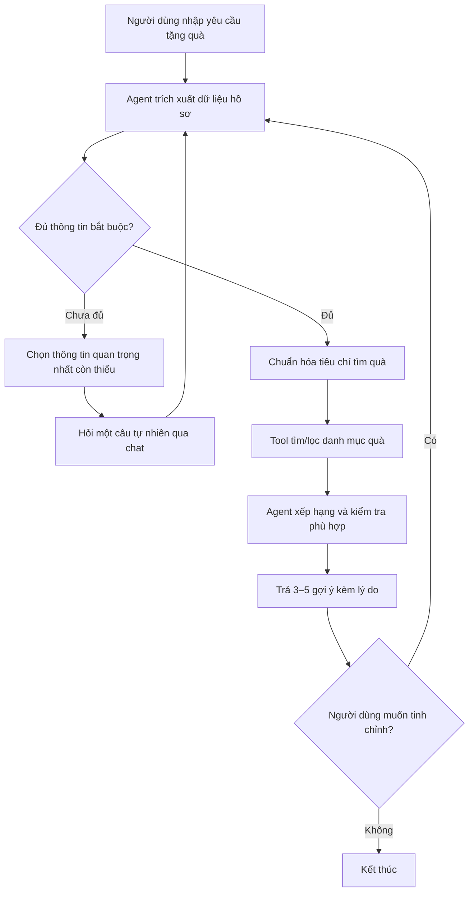

# Context dự án — Trợ lý nắm bắt tính cách & chọn quà tặng phù hợp

## 1. Mục tiêu chung

Nhóm xây dựng một trợ lý hội thoại giúp người dùng chọn quà cho **một người khác**. Người dùng tương tác qua giao diện chat; agent chủ động thu thập thông tin về người nhận quà, chỉ chuyển sang bước tìm quà khi dữ liệu đã đủ để đưa ra gợi ý có căn cứ.

Điểm trọng tâm không phải là liệt kê quà chung chung, mà là thể hiện được hành vi agentic:

1. Nhận biết thông tin còn thiếu.
2. Hỏi tiếp bằng ngôn ngữ tự nhiên, ngắn gọn và đúng ngữ cảnh.
3. Lưu/cập nhật hồ sơ người nhận qua từng lượt chat.
4. Kiểm tra điều kiện đủ dữ liệu.
5. Gọi tool tìm quà, đối chiếu với hồ sơ và trả lời có lý do.

## 2. Phạm vi sản phẩm

### Luồng người dùng



### Hồ sơ người nhận quà (recipient profile)

Agent duy trì một state có cấu trúc, nhưng không bắt người dùng điền form. Các trường được trích xuất từ hội thoại:

| Nhóm | Trường | Mức độ | Ghi chú |
| --- | --- | --- | --- |
| Quan hệ/ngữ cảnh | `relationship`, `occasion` | Bắt buộc | Ví dụ: bạn thân, người yêu, đồng nghiệp; sinh nhật/kỷ niệm/cảm ơn. |
| Sở thích | `interests`, `hobbies`, `likes`, `dislikes` | Bắt buộc (ít nhất 1 tín hiệu) | Có thể suy ra từ mô tả hành vi hoặc thói quen. |
| Ràng buộc | `budget_min`, `budget_max` hoặc `budget_level` | Bắt buộc | Luôn làm rõ ngân sách trước khi tìm quà. |
| Thông tin nền | `age_range`, `occupation_or_lifestyle` | Nên có | Chỉ hỏi khi giúp cải thiện đáng kể kết quả. |
| Tính cách | `personality_traits`, `gift_style` | Nên có | Ví dụ: thực tế, hướng nội, thích trải nghiệm, tối giản. Không chẩn đoán tâm lý. |
| Logistics | `delivery_location`, `deadline`, `personalization_allowed` | Tùy tình huống | Cần khi tìm sản phẩm/dịch vụ cụ thể hoặc có thời hạn giao. |

### Điều kiện chuyển node: đủ dữ liệu

Agent chỉ được chuyển từ node **Thu thập thông tin** sang **Tìm quà** khi có đủ:

- `occasion` hoặc mục đích tặng quà;
- `relationship` hoặc mức độ thân thiết;
- ngân sách; và
- tối thiểu một tín hiệu về sở thích, phong cách sống, nhu cầu hoặc điều cần tránh.

Nếu thiếu nhiều trường, mỗi lượt chỉ hỏi **một câu ưu tiên cao nhất** (hoặc tối đa hai ý liên quan chặt chẽ). Không lặp lại thông tin người dùng đã cung cấp.

Ví dụ phản hồi khi chưa đủ dữ liệu:

> “Mình hiểu bạn đang tìm quà sinh nhật cho bạn thân. Để chọn đúng hơn, ngân sách bạn dự kiến khoảng bao nhiêu?”

Ví dụ phản hồi khi đã đủ dữ liệu:

> “Với ngân sách 500–800 nghìn, người nhận thích cà phê và phong cách tối giản, mình sẽ tìm các quà thực dụng, ít rủi ro và có thể cá nhân hóa.”

## 3. Hành vi Agent cần triển khai

### State machine đề xuất

| Node | Trách nhiệm | Đầu ra / điều kiện chuyển |
| --- | --- | --- |
| `intake` | Chào hỏi, hiểu yêu cầu ban đầu, tạo hồ sơ rỗng. | Chuyển `collect_profile`. |
| `collect_profile` | Trích xuất dữ liệu từ tin nhắn, đánh dấu trường thiếu và hỏi tiếp. | Đủ điều kiện thì chuyển `search_gifts`. |
| `search_gifts` | Gọi tool bằng bộ lọc từ hồ sơ. | Nhận danh sách quà hoặc lỗi tool. |
| `rank_and_explain` | Lọc theo ngân sách/điều cần tránh, xếp hạng và giải thích mức phù hợp. | Trả 3–5 gợi ý; chuyển `refine` nếu người dùng đổi yêu cầu. |
| `fallback` | Xử lý dữ liệu mơ hồ, tool lỗi, vượt giới hạn lặp hoặc không có kết quả. | Xin làm rõ / đề xuất nới điều kiện một cách lịch sự. |

### ReAct trace mong muốn

```text
User: Tìm quà sinh nhật cho bạn thân nữ, bạn ấy thích đọc sách và cà phê.
Thought: Đã có dịp tặng, quan hệ và sở thích; còn thiếu ngân sách.
Action: ask_follow_up["Ngân sách của bạn khoảng bao nhiêu?"]
Observation: User trả lời: Khoảng 500–800 nghìn.

Thought: Hồ sơ đã đủ; cần tìm quà trong ngân sách, liên quan sách/cà phê.
Action: search_gifts[{"interests": ["đọc sách", "cà phê"], "budget_max": 800000}]
Observation: [...danh sách quà hợp lệ...]

Thought: Đã có kết quả, cần ưu tiên quà phù hợp sở thích và tính cá nhân.
Final Answer: 3 gợi ý quà kèm giá, lý do phù hợp và lưu ý đặt mua.
```

Lưu ý: `Thought`, `Action`, `Observation` phục vụ trace/debug nội bộ. Giao diện người dùng chỉ cần hiển thị câu hỏi làm rõ và câu trả lời cuối cùng; không hiển thị chain-of-thought chi tiết.

## 4. Tool contract đề xuất

| Tool | Mục đích | Input chính | Output tối thiểu |
| --- | --- | --- | --- |
| `get_profile_completeness` | Kiểm tra trường bắt buộc còn thiếu. | `recipient_profile` | `is_complete`, `missing_fields`, `next_question_topic`. |
| `search_gifts` | Tìm quà theo hồ sơ và ngân sách. | sở thích, tính cách, dịp, quan hệ, ngân sách, điều cần tránh | danh sách quà gồm tên, giá, danh mục, tags, nguồn/link (nếu có), trạng thái còn hàng. |
| `rank_gifts` | Chấm/xếp hạng quà từ dữ liệu tool. | hồ sơ + danh sách quà | điểm phù hợp, lý do, cảnh báo rủi ro. |
| `get_gift_details` *(tùy chọn)* | Xem chi tiết một sản phẩm/dịch vụ. | `gift_id` | mô tả, giá, tồn kho, vận chuyển/cá nhân hóa. |

Trong demo offline, `search_gifts` có thể đọc từ catalog JSON deterministic thay vì gọi API thương mại. Mọi tool phải có schema rõ ràng, bắt lỗi và **trả lỗi như dữ liệu**, không làm app crash.

## 5. Quy tắc hội thoại và an toàn

- Hỏi thân thiện, không biến chat thành bảng khảo sát.
- Không suy diễn giới tính, thu nhập, sở thích hay tình trạng quan hệ khi chưa có dữ liệu; dùng câu hỏi mở khi cần.
- Không đưa ra chẩn đoán hoặc kết luận sức khỏe/tâm lý từ “tính cách”.
- Không yêu cầu hoặc lưu PII không cần thiết (địa chỉ, số điện thoại, thông tin tài chính). Chỉ hỏi địa điểm giao hàng khi người dùng thực sự muốn mua/giao quà.
- Tôn trọng điều cần tránh: dị ứng, kiêng kỵ, quà quá riêng tư, sản phẩm có cồn… Nếu chưa chắc, hỏi lại.
- Nếu catalog không có quà phù hợp, giải thích giới hạn và đề xuất nới **một** ràng buộc (ngân sách, loại quà hoặc thời gian giao), không bịa sản phẩm/link/giá.
- Có `MAX_ITERATIONS` / giới hạn số câu hỏi để tránh loop. Khi đạt ngưỡng, tóm tắt dữ liệu đã có và đề nghị người dùng cung cấp một thông tin then chốt.

## 6. Yêu cầu của Lab cần phản ánh trong dự án

| Hạng mục | Cách áp dụng cho đề tài |
| --- | --- |
| Chatbot baseline | Trả lời một lần, không gọi tool; có thể đưa gợi ý chung và nói rõ không có catalog/giá thực tế. |
| ReAct Agent | Luân phiên `Thought → Action → Observation`; dùng state hồ sơ để quyết định hỏi tiếp hay tìm quà. |
| Tool interaction | Tối thiểu tool kiểm tra độ đủ của profile và tool tìm quà; tool deterministic để dễ test. |
| Guardrails | Giới hạn vòng lặp, validate ngân sách/input, fallback khi tool lỗi hoặc không có kết quả. |
| Observability | Ghi trace gồm session/test ID, profile cập nhật, missing fields, tool call, observation, node chuyển tiếp, số iteration và fallback. |
| Hybrid flow | Câu hỏi xã giao/chung chung đi Chatbot path; yêu cầu tư vấn quà có ràng buộc hoặc cần catalog đi Agent path. |
| Bonus | Memory theo phiên hoặc preference đã được người dùng đồng ý lưu; không lưu dữ liệu nhạy cảm. |

## 7. Test cases tối thiểu

1. **Đủ thông tin ngay từ đầu:** có dịp, quan hệ, sở thích và ngân sách → Agent gọi tìm quà, không hỏi dư.
2. **Thiếu ngân sách:** Agent hỏi đúng ngân sách → sau khi có câu trả lời mới tìm quà.
3. **Thiếu sở thích:** Agent hỏi một câu gợi mở phù hợp thay vì đoán.
4. **Nhiều ràng buộc:** ví dụ quà sinh nhật, 300–500 nghìn, thích game, cần giao trước ngày mai → lọc đúng và cảnh báo logistics nếu cần.
5. **Không tìm thấy:** ngân sách quá thấp/điều kiện mâu thuẫn → fallback lịch sự, đề xuất nới ràng buộc.
6. **Edge case:** người dùng đổi đối tượng/đổi ngân sách giữa chừng → state phải cập nhật, không dùng lại dữ liệu cũ sai ngữ cảnh.

Mỗi test cần nêu: input ban đầu, state kỳ vọng sau mỗi lượt, tool call kỳ vọng, final answer/fallback kỳ vọng và trace thực tế.

## 8. Phân công gợi ý theo cấu trúc Lab

| Role | Deliverable cho đề tài |
| --- | --- |
| Product Architect | Định nghĩa schema `recipient_profile`, điều kiện đủ dữ liệu và bộ test cases. |
| Tool Engineer | Catalog quà deterministic + `search_gifts`, kiểm tra completeness và error contract. |
| Prompt Engineer | Prompt hỏi tự nhiên, trích xuất profile, ReAct format và guardrails. |
| Core Developer / Integrator | Điều phối state machine, giao diện chat, parser/executor và giới hạn loop. |
| Observability | Scoring Matrix, trace test, so sánh baseline–agent và hybrid flowchart. |

## 9. Tiêu chí hoàn thành bản demo

- Người dùng có thể chat tự nhiên bằng tiếng Việt.
- Agent biết chính xác vì sao chưa thể tìm quà và hỏi tiếp thông tin còn thiếu.
- Agent không gọi `search_gifts` trước khi profile đủ điều kiện.
- Khi profile đủ, agent gọi tool và đưa ra 3–5 quà trong ngân sách, mỗi quà có lý do phù hợp.
- Tool lỗi, thiếu kết quả hoặc hội thoại vòng lặp đều có fallback an toàn.
- Có trace chứng minh luồng `Thought → Action → Observation`, và có so sánh với chatbot baseline.

## 10. Quy ước làm việc

- Mỗi role ưu tiên sửa file mình phụ trách; integrator xử lý điểm ghép nối sau khi đồng bộ.
- Không commit API key, token, lịch sử chat thật hoặc PII vào repository.
- Khi thay schema profile/tool, cập nhật đồng thời test case, prompt và tài liệu trace.
- Mọi giả định về dữ liệu quà (giá, tồn kho, cửa hàng) phải ghi rõ là catalog demo nếu chưa dùng nguồn dữ liệu thực.
