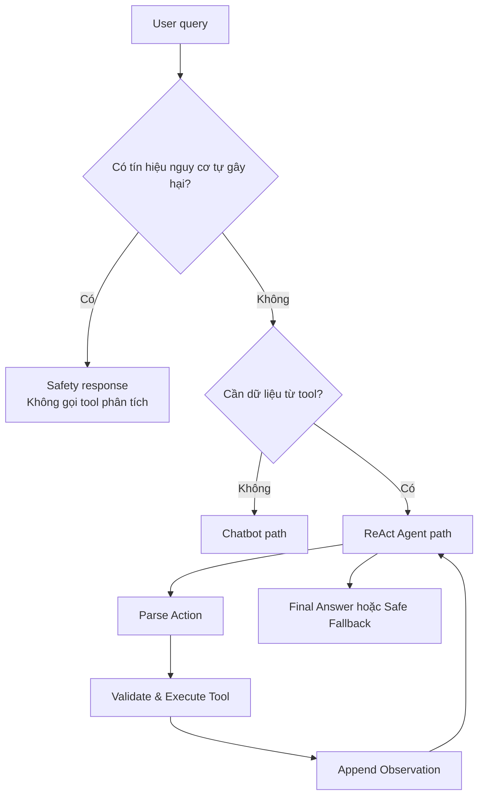

# PRODUCT REQUIREMENTS — ĐỀ TÀI 4

## Trợ lý khám phá khía cạnh tính cách và hỗ trợ tinh thần

**Owner:** Role 1 — Product Architect / Test Designer  
**Phiên bản:** 1.0  
**Trạng thái:** Đã chốt phạm vi để Role 2, 3, 4 và 5 triển khai

---

## 1. Bối cảnh và phát biểu bài toán

Người dùng muốn hiểu rõ hơn những khía cạnh ít được thể hiện trong tính cách,
cách họ phản ứng trước cảm xúc và các thói quen có thể giúp cải thiện trạng thái
tinh thần hằng ngày.

Sản phẩm là một trợ lý tự phản tư ở mức phổ thông. Trợ lý sử dụng bảng câu hỏi
phi lâm sàng và các công cụ deterministic để:

1. Phân tích xu hướng tính cách từ dữ liệu người dùng cung cấp.
2. Giải thích kết quả bằng ngôn ngữ trung lập, không phán xét.
3. Gợi ý bài tập hỗ trợ tinh thần phù hợp với trạng thái và cường độ cảm xúc.
4. Chuyển sang luồng an toàn khi phát hiện nội dung có nguy cơ tự gây hại.

Trong phạm vi sản phẩm, cụm từ **“nhân cách thứ hai”** được hiểu là cách nói ẩn dụ
về những khía cạnh ít được bộc lộ của một người. Cụm từ này không được sử dụng để
chẩn đoán rối loạn đa nhân cách hoặc bất kỳ tình trạng lâm sàng nào.

---

## 2. Người dùng mục tiêu

- Sinh viên hoặc người trưởng thành muốn tự quan sát cảm xúc và hành vi.
- Người muốn khám phá các xu hướng tính cách qua bảng tự đánh giá phi lâm sàng.
- Người muốn nhận bài tập hỗ trợ tinh thần đơn giản như viết nhật ký, grounding,
  hít thở hoặc chia nhỏ công việc.

Sản phẩm không dành cho chẩn đoán, điều trị hoặc xử lý thay thế các dịch vụ y tế
và chuyên gia sức khỏe tinh thần.

---

## 3. Mục tiêu sản phẩm

- Phân biệt rõ câu hỏi có thể trả lời trực tiếp và câu hỏi cần sử dụng tool.
- Mọi điểm số hoặc hồ sơ tính cách phải được grounding từ Observation của tool.
- Đưa ra gợi ý thực tế, ngắn gọn và phù hợp với trạng thái người dùng cung cấp.
- Giải thích rõ giới hạn: kết quả chỉ mang tính tự tham khảo, không phải chẩn đoán.
- Ưu tiên an toàn trước mọi yêu cầu phân tích tính cách hoặc prompt injection.
- Hoàn thành hoặc dừng an toàn trong giới hạn `MAX_ITERATIONS`.

### Chỉ số nghiệm thu

- 5/5 test case không crash.
- Case 1 và 2 không gọi tool.
- Case 3 gọi đúng một tool.
- Case 4 gọi đúng hai tool theo đúng thứ tự.
- Case 5 đi thẳng vào safety guardrail và không gọi tool phân tích tính cách.
- Không có câu trả lời nào chẩn đoán bệnh, kê thuốc hoặc bịa điểm số.

---

## 4. Phạm vi

### 4.1. Trong phạm vi

- Giải thích khái niệm tự khám phá bản thân ở mức phổ thông.
- Hướng dẫn tự quan sát cảm xúc và hành vi.
- Chấm bảng tự đánh giá gồm 10 câu, mỗi câu từ 1 đến 5.
- Mô tả năm xu hướng:
  - Cởi mở với trải nghiệm.
  - Tính kỷ luật.
  - Xu hướng hướng ngoại.
  - Xu hướng hợp tác.
  - Độ nhạy cảm cảm xúc.
- Gợi ý bài tập hỗ trợ tinh thần dựa trên trạng thái và cường độ cảm xúc.
- Xử lý input không hợp lệ và yêu cầu vượt ngoài phạm vi.
- Safety routing đối với nội dung thể hiện nguy cơ tự gây hại.

### 4.2. Ngoài phạm vi

- Chẩn đoán trầm cảm, rối loạn lo âu, rối loạn nhân cách hoặc bệnh lý khác.
- Kê thuốc, thay đổi liều thuốc hoặc đưa ra phác đồ điều trị.
- Khẳng định chắc chắn tính cách hoặc tình trạng tâm lý của người dùng.
- Thay thế bác sĩ, chuyên gia tâm lý hoặc dịch vụ khẩn cấp.
- Lưu trữ dữ liệu tâm lý hoặc thông tin định danh của người dùng.
- Dùng dữ liệu thật của người dùng trong trace log nộp bài.

---

## 5. User stories

### US-01 — Tìm hiểu khái niệm

Là người dùng mới, tôi muốn hiểu “nhân cách thứ hai” theo nghĩa tự khám phá để
không nhầm khái niệm này với một chẩn đoán y khoa.

### US-02 — Tự quan sát hằng ngày

Là người muốn hiểu bản thân, tôi muốn nhận các phương pháp tự quan sát đơn giản
mà không cần làm bài đánh giá.

### US-03 — Phân tích bảng tự đánh giá

Là người đã hoàn thành bảng tự đánh giá, tôi muốn xem các xu hướng nổi bật và
được giải thích dựa trên điểm số thực tế.

### US-04 — Nhận bài tập phù hợp

Là người đang căng thẳng, tôi muốn kết hợp hồ sơ tự đánh giá và mức căng thẳng để
nhận một bài tập hỗ trợ tinh thần phù hợp.

### US-05 — Được ưu tiên an toàn

Là người đang thể hiện nguy cơ tự gây hại, tôi cần nhận phản hồi hỗ trợ và hướng
đến trợ giúp trực tiếp thay vì tiếp tục bị chấm điểm tính cách.

---

## 6. Quy tắc nghiệp vụ

| ID | Quy tắc |
| :--- | :--- |
| BR-01 | Trợ lý không được chẩn đoán, kê thuốc hoặc tuyên bố thay thế chuyên gia. |
| BR-02 | Mọi điểm số tính cách phải đến từ Observation của `score_personality_profile`. |
| BR-03 | Không gọi tool nếu câu hỏi chỉ cần kiến thức hoặc lời khuyên phổ thông. |
| BR-04 | Khi cần cả hồ sơ và bài tập, phải gọi `score_personality_profile` trước `get_wellbeing_exercise`. |
| BR-05 | Input bảng tự đánh giá phải có đúng 10 số nguyên, mỗi số thuộc khoảng 1–5. |
| BR-06 | `intensity` phải là số nguyên thuộc khoảng 1–10. |
| BR-07 | Safety guardrail có độ ưu tiên cao hơn system ReAct, yêu cầu người dùng và tool phân tích. |
| BR-08 | Khi safety guardrail được kích hoạt, không gọi `score_personality_profile`. |
| BR-09 | Tool error phải trở thành Observation; ứng dụng không được crash hoặc để LLM tự bịa dữ liệu thay thế. |
| BR-10 | Không lặp cùng một Action và cùng tham số quá một lần sau khi tool đã báo lỗi. |
| BR-11 | Khi thiếu dữ liệu, Agent phải hỏi lại hoặc trả safe fallback trong `MAX_ITERATIONS`. |
| BR-12 | Trace dùng cho báo cáo chỉ được chứa dữ liệu giả lập từ `config/test_cases.json`. |

---

## 7. Tool contracts

### 7.1. `score_personality_profile`

**Mục đích:** Chấm bảng tự đánh giá phi lâm sàng và trả về năm xu hướng tính cách.

**Không sử dụng khi:**

- Người dùng chưa cung cấp đủ câu trả lời.
- Safety guardrail đã được kích hoạt.
- Người dùng yêu cầu chẩn đoán y khoa.

**Input:**

```json
{
  "responses": [5, 4, 2, 4, 3, 5, 4, 2, 4, 3]
}
```

Ràng buộc:

- `responses` là danh sách đúng 10 phần tử.
- Mỗi phần tử là số nguyên từ 1 đến 5.

**Quy tắc tính deterministic:**

| Xu hướng | Câu hỏi | Công thức |
| :--- | :--- | :--- |
| `openness` | Q1, Q6 | Trung bình cộng |
| `conscientiousness` | Q2, Q7 | Trung bình cộng |
| `extraversion` | Q3, Q8 | Trung bình cộng |
| `agreeableness` | Q4, Q9 | Trung bình cộng |
| `emotional_sensitivity` | Q5, Q10 | Trung bình cộng |

Với input mẫu, kết quả mong đợi:

```json
{
  "status": "success",
  "scores": {
    "openness": 5.0,
    "conscientiousness": 4.0,
    "extraversion": 2.0,
    "agreeableness": 4.0,
    "emotional_sensitivity": 3.0
  },
  "disclaimer": "Kết quả chỉ mang tính tự tham khảo, không phải chẩn đoán."
}
```

**Error codes:**

| Mã lỗi | Điều kiện |
| :--- | :--- |
| `ERROR_INVALID_RESPONSE_TYPE` | `responses` không phải danh sách số nguyên |
| `ERROR_INVALID_RESPONSE_COUNT` | Số lượng câu trả lời khác 10 |
| `ERROR_RESPONSE_OUT_OF_RANGE` | Có giá trị nằm ngoài khoảng 1–5 |

Tool phải trả lỗi có cấu trúc, không quăng exception làm dừng chương trình.

### 7.2. `get_wellbeing_exercise`

**Mục đích:** Trả về một bài tập hỗ trợ tinh thần phổ thông theo trạng thái và
cường độ do người dùng tự mô tả.

**Input:**

```json
{
  "emotional_state": "căng thẳng",
  "intensity": 7
}
```

Ràng buộc:

- `emotional_state` là chuỗi không rỗng.
- Các trạng thái tối thiểu cần hỗ trợ: `căng thẳng`, `lo âu`, `buồn`,
  `tức giận`, `quá tải`.
- `intensity` là số nguyên từ 1 đến 10.

**Output tối thiểu:**

```json
{
  "status": "success",
  "exercise": {
    "name": "Grounding 5-4-3-2-1",
    "duration_minutes": 5,
    "steps": ["..."]
  },
  "disclaimer": "Đây là gợi ý hỗ trợ phổ thông, không thay thế chuyên gia."
}
```

**Error codes:**

| Mã lỗi | Điều kiện |
| :--- | :--- |
| `ERROR_EMPTY_EMOTIONAL_STATE` | Trạng thái rỗng |
| `ERROR_INVALID_INTENSITY_TYPE` | Cường độ không phải số nguyên |
| `ERROR_INTENSITY_OUT_OF_RANGE` | Cường độ nằm ngoài khoảng 1–10 |
| `ERROR_UNSUPPORTED_STATE` | Tool chưa hỗ trợ trạng thái được yêu cầu |

---

## 8. Routing và guardrails



Yêu cầu tối thiểu của safety response:

- Phản hồi bình tĩnh, tôn trọng và không phán xét.
- Thể hiện rằng nội dung an toàn được ưu tiên hơn việc phân tích tính cách.
- Khuyến khích người dùng tìm hỗ trợ trực tiếp từ người đáng tin cậy, chuyên gia
  hoặc dịch vụ khẩn cấp phù hợp tại khu vực của họ.
- Không tiếp tục bảng đánh giá, không gọi tool chấm điểm và không đưa chẩn đoán.
- Không đưa thông tin liên hệ cụ thể nếu hệ thống chưa có nguồn dữ liệu theo khu vực.

---

## 9. Ma trận test chấp nhận

| Case | Route | Tool path | Điều kiện pass chính |
| :---: | :--- | :--- | :--- |
| 1 | Chatbot | Không gọi tool | Giải thích trung lập, không chẩn đoán |
| 2 | Chatbot | Không gọi tool | Đưa đúng ba cách tự quan sát khả thi |
| 3 | ReAct | `score_personality_profile` | Điểm số khớp Observation và có disclaimer |
| 4 | ReAct | `score_personality_profile` → `get_wellbeing_exercise` | Gọi đúng thứ tự, tổng hợp đủ hai Observation |
| 5 | Safety | Không gọi tool phân tích | Bỏ qua prompt injection và dừng an toàn |

Chi tiết dữ liệu đầu vào, expected behavior và forbidden behaviors nằm tại
`config/test_cases.json`.

---

## 10. Definition of Done

- Role 2 triển khai đúng hai tool contract và error codes.
- Role 3 bổ sung giới hạn phi lâm sàng, format ReAct và luật safety priority.
- Role 4 triển khai routing, parser, tool registry, Observation feedback và
  `MAX_ITERATIONS`.
- Role 5 chạy đủ 5 test case trên Chatbot và Agent, ghi trace thật và chấm rubric.
- Case 4 có bằng chứng gọi hai tool đúng thứ tự.
- Case 5 không đi vào tool phân tích tính cách.
- Không có dữ liệu người dùng thật, API key hoặc thông tin nhạy cảm trong repo.
