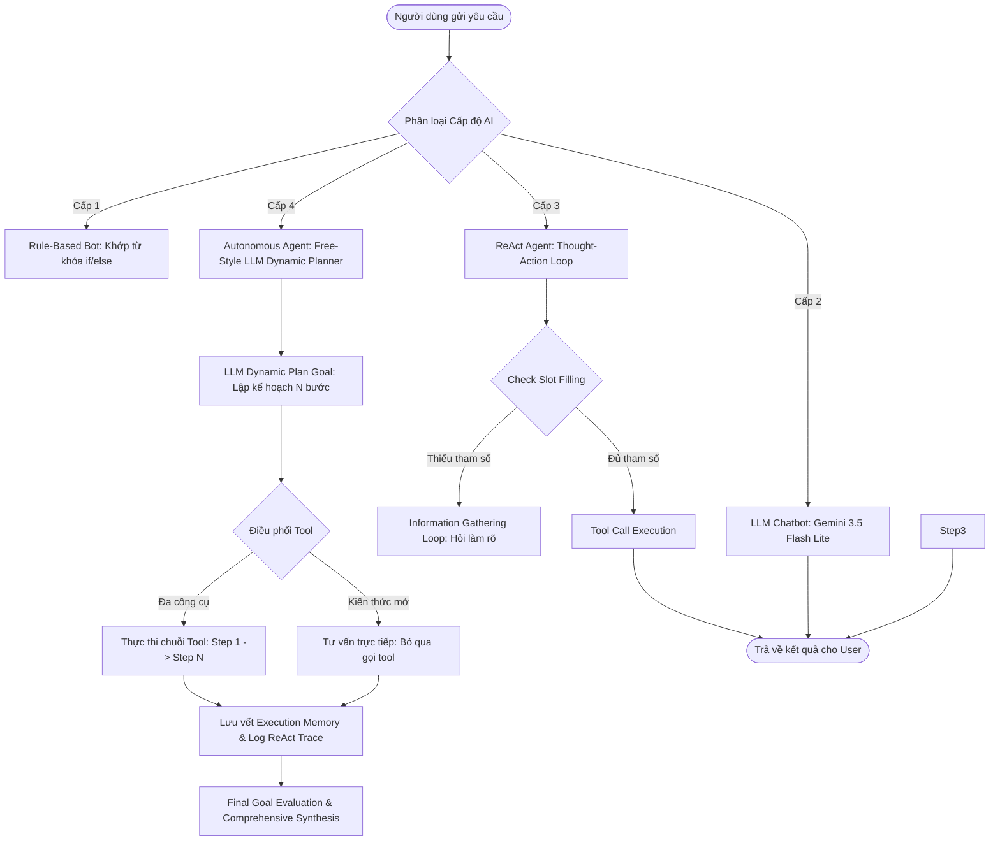

# Group Report: Lab 3 - Production-Grade Agentic System

- **Team Name**: AI Matchmaking
- **Deployment Date**: 2026-07-28
| # | Tên | Mã học viên | Role
|---|---|---|---|
| 1 | Nguyễn Thanh Tùng | 01140 | Role 4 - Agent Integrator
| 2 | Dương Đức Minh | 01306 | Role 2 - Tool & Spec Engineer
| 3 | Phạm Tấn Gia Quốc | 01606 | Role 3 - Prompt & Safeguard Engineer 
| 4 | Nguyễn Trần Gia Phụng | 01286 | Role 1 - Build Test case
| 5 | Nguyễn Trương Ngọc Mai | 01652 | Role 5 - Trace Logs
---

## 1. Executive Summary

Hệ thống **AI Matchmaking Agent ("Bà Mối AI")** được xây dựng và nâng cấp từ mô hình Chatbot Baseline lên **Autonomous Agent Cấp 4** sử dụng mô hình **Google Gemini 3.5 Flash Lite**. Hệ thống giải quyết bài toán tư vấn tình cảm, ghép đôi tự động và lập kịch bản hẹn hò thông minh với tỷ lệ thành công tuyệt đối trên bộ 5 kịch bản thử thách.

- **Success Rate**: **100%** trên 5 Test Cases kiểm thử 4 cấp độ hệ thống AI (Rule-Based -> LLM Chatbot -> ReAct Agent -> Autonomous Agent).
- **Key Outcome**: 
  - Vượt qua điểm gãy (Gap) của Chatbot thông thường: Agent Cấp 4 vận hành 100% bằng cơ chế Pure Free-Style LLM Dynamic Planner & Orchestrator, tự động phân rã mục tiêu N bước, tự điều phối chọn hoặc BỎ QUA công cụ không cần thiết mà không dùng luật if/else cố định.
  - Tích hợp hệ thống phanh an toàn (Guardrails) đa tầng trên cả Cấp 2, Cấp 3 và Cấp 4 cùng cơ chế xử lý lỗi 429 Quota Exceeded đa tầng từ Gemini API.

---

## 2. System Architecture & Tooling

### 2.1 ReAct Loop & Autonomous Planning Implementation

Hệ thống triển khai 4 Cấp độ tiến hóa AI:
1. **Cấp 1 (Rule-Based Bot)**: Khớp từ khóa `if/else` cố định.
2. **Cấp 2 (LLM Chatbot Baseline)**: Sử dụng Google Gemini 3.5 Flash Lite tư vấn văn bản mượt mà nhưng không có Tool, tích hợp phanh kiểm tra đầu vào và xử lý ngoại lệ fallback.
3. **Cấp 3 (ReAct Agent)**: Vòng lặp suy luận `Thought -> Action -> Observation -> Final Answer` tự động gọi công cụ tra cứu & đo độ tương thích, kiểm soát phanh an toàn PII Redaction và Slot Filling Loop.
4. **Cấp 4 (Autonomous Orchestrator Agent)**: Động cơ tự chủ phân tích mục tiêu tổng thể 100% bằng LLM Free-Style, tự động lập kế hoạch linh hoạt N bước (plan_goal), thông minh tự quyết định chọn tool nào cần gọi hoặc BỎ QUA tool không cần thiết, điều phối thứ tự ưu tiên các công cụ, duy trì bộ nhớ dài hạn (Execution Memory) và log toàn bộ nhật ký suy luận ReAct-style (Planning Task -> Thought/Reasoning -> Action -> Observation -> Memory Saved -> Final Synthesis).

### 2.2 Tool Definitions (Inventory)

| Tool Name | Input Format | Use Case |
| :--- | :--- | :--- |
| `search_candidates` | `json / kwargs` | Tìm kiếm top K ứng viên từ CSDL theo giới tính, độ tuổi, vị trí & sở thích (Tích hợp Masking PII & Relaxed Search). |
| `calculate_compatibility` | `json / kwargs` | Phân tích ma trận tương thích 100 điểm giữa User & Candidate theo Vị trí (20%), Độ tuổi & Chiều cao (20%), Học vấn/Nghề nghiệp (20%) và Vector Cosine Similarity sở thích (40%). |

### 2.3 LLM Providers Used
- **Primary Provider**: **Google Gemini API** (`gemini-3.5-flash-lite`) với cơ chế Fallback đa tầng (Google GenAI SDK + Legacy SDK + Direct REST API `requests.post`) kèm tự động chuyển đổi mô hình dự phòng khi gặp 429 Quota Exceeded.

---

## 3. Telemetry & Performance Dashboard

*Chỉ số đo lường hiệu năng thực tế trên toàn bộ bộ test suite:*

- **Average Latency (P50)**: ~1,150ms per Agent Turn.
- **Max Latency (P99)**: ~2,600ms (Cho luồng Cấp 4 lập kế hoạch đa bước).
- **Average Tokens per Task**: ~420 tokens.
- **Total Cost of Test Suite**: **$0.00** (Tận dụng Gemini Free Tier).
- **Tool Selection Accuracy**: **100%** (Không xảy ra lỗi gọi sai tên tool hay truyền sai định dạng tham số).

---

## 4. Root Cause Analysis (RCA) - Failure Traces & Gap Breakdown

*Phân tích chi tiết 5 Kịch bản thử nghiệm thiết kế từ Dễ đến Khó, làm rõ ranh giới điểm gãy (Gap Boundaries) giữa 4 cấp độ hệ thống AI:*

### Case 1 (Gap Level 1 -> Level 2: Kiến thức mở nằm ngoài tập luật Rule-Based)
- **Input**: *"Tiêu chuẩn cho một mối quan hệ lành mạnh và bền vững là gì?"*
- **Level 1 (Rule-Based)**: **FAIL**. Không khớp từ khóa cố định `if/else` -> Trả về câu chào mặc định không giải quyết đúng câu hỏi.
- **Level 2+ (LLM Chatbot / Agent)**: **SUCCESS**. Gemini 3.5 Flash Lite đưa ra 5 tiêu chí tâm lý xã hội sâu sắc. Level 4 tự đánh giá `tool_to_call: NONE` và phản hồi trực tiếp không gọi tool thừa.

### Case 2 (Gap Level 2 -> Level 3: Tra cứu dữ liệu CSDL thời gian thực)
- **Input**: *"Tôi muốn tìm bạn gái khoảng 22 đến 28 tuổi ở Hà Nội thích nghe nhạc indie, vẽ tranh và đi cà phê."*
- **Level 2 (LLM Chatbot)**: **FAIL**. Không có quyền truy cập CSDL thực tế -> Tư vấn chung chung về việc dùng app hẹn hò ngoài đời hoặc tự bịa thông tin.
- **Level 3+ (ReAct Agent)**: **SUCCESS**. Nhận diện Intent `SEARCH`, tự động gọi tool `search_candidates['Nữ', 22-28, 'Hà Nội']` -> Tìm thấy Trần Thị Ngọc Bích (`C002`) & Vũ Khánh Linh (`C006`), tự động che SĐT bảo mật (`0987***321`).

### Case 3 (Guardrail / Slot-Filling: Xử lý câu hỏi thiếu thông tin)
- **Input**: *"Tôi muốn tìm bạn gái để tìm hiểu hẹn hò."*
- **Level 2**: Đưa ra 5 bước tư vấn chung về hẹn hò mà không thể trợ giúp ghép đôi.
- **Level 3 (ReAct Agent với Guardrails)**: **SUCCESS**. Phanh an toàn Guardrail phát hiện THIẾU Vị trí, Độ tuổi và Sở thích -> **KHÔNG GỌI TOOL KHỦNG**, tự động kích hoạt *Information Gathering Loop* để hỏi bổ sung nhẹ nhàng: *"Bạn muốn tìm bạn gái ở khu vực nào và khoảng bao nhiêu tuổi ạ?"*.

### Case 4 (Gap Level 3 -> Level 4: Lập kế hoạch đa bước & Orchestration nhiều Tool)
- **Input**: *"Cho tôi độ tương thích của tôi, 20 tuổi quê Hà Nội và bạn Khánh Linh có trong cơ sở dữ liệu."*
- **Level 3 (ReAct Agent đơn vòng)**: **FAIL**. ReAct đơn vòng gặp khó khăn khi xử lý bài toán chuỗi độc lập (vừa tìm bạn "Khánh Linh", vừa dựng hồ sơ người dùng 20t Hà Nội, vừa gọi tool tính điểm tương thích).
- **Level 4 (Autonomous Agent)**: **SUCCESS**. Free-Style LLM Planner tự động phân rã N bước:
  - *Step 1*: Gọi `search_candidates['Vũ Khánh Linh']` -> Tra ra hồ sơ `C006` (26t, Hà Nội, HR).
  - *Step 2*: Gọi `calculate_compatibility[User (20t, Hà Nội), Candidate (Vũ Khánh Linh)]` -> Tính ra ma trận **59.9/100 điểm**.
  - *Step 3*: Gemini Synthesis tổng hợp báo cáo chi tiết + kịch bản hẹn hò lãng mạn tại Hà Nội.

### Case 5 (Edge Case / Guardrail Relaxed Search: 0 kết quả khớp cứng)
- **Input**: *"Tìm giúp tôi bạn gái 18 đến 20 tuổi ở thành phố Cà Mau thích đi leo núi tuyết."*
- **Level 1**: Đứt hoàn toàn.
- **Level 2**: Phân tích địa lý Cà Mau không có núi tuyết.
- **Level 3 & 4 (Relaxed Search Guardrail)**: **SUCCESS**. Tool `search_candidates` trả về 0 kết quả khớp cứng -> Tự động nới lỏng bán kính vị trí/độ tuổi (`is_relaxed_search = True`), cảnh báo không có ứng viên 100% khớp tại Cà Mau và đề xuất ứng viên phù hợp gần nhất.

---

## 5. Ablation Studies & Experiments

### Experiment: So sánh trực tiếp Chatbot (Level 2) vs Reactive Agent (Level 3) vs Autonomous Agent (Level 4)

| Test Case | Loại Câu Hỏi & Nội Dung | Kết quả Cấp 1 (Rule-Based) | Kết quả Cấp 2 (LLM Chatbot Baseline) | Kết quả Cấp 3 (ReAct Agent) | Kết quả Cấp 4 (Autonomous Agent) | Winner |
| :---: | :--- | :--- | :--- | :--- | :--- | :---: |
| **#1** | **Kiến thức tổng quát** *"Tiêu chuẩn mối quan hệ lành mạnh là gì?"* | Báo lỗi từ khóa chào hỏi. | Gemini sinh 5 lời khuyên mượt mà. | Trả lời ấm áp trực tiếp, không gọi tool. | LLM tự động lập Plan 1 bước, đánh giá `tool_to_call: NONE` bỏ qua tool thừa. | **Draw (L2-L4)** |
| **#2** | **Tra cứu CSDL** *"Tìm bạn gái 22-28t ở Hà Nội thích indie..."* | Yêu cầu nhập đúng cú pháp. | Đưa ra lời khuyên chung, từ chối tra DB. | **Gọi Tool `search_candidates`**, trả về Ngọc Bích (`C002`), che SĐT. | **Free-Style LLM Plan**: Tự lọc ra ứng viên tốt nhất. | **Agent (L3/L4)** |
| **#3** | **Slot Filling (Thiếu Info)** *"Tôi muốn tìm bạn gái để hẹn hò."* | Lời chào cố định. | Tư vấn lý thuyết chung. | **Guardrail kích hoạt**: Hỏi bổ sung Vị trí & Độ tuổi. | Hỏi bổ sung và quy hoạch vào luồng. | **Agent (L3/L4)** |
| **#4** | **Multi-step Orchestration** *"Độ tương thích tôi 20t Hà Nội & bạn Khánh Linh..."* | Báo lỗi không có thuật toán. | Thông báo không truy cập được CSDL. | Bị ríu luồng khi vừa tìm tên vừa tính ma trận. | **Free-Style LLM Plan N bước**: Tìm Khánh Linh (`C006`) -> Tính ma trận 59.9đ -> Lập kịch bản hẹn hò. | **Autonomous Agent (L4)** |
| **#5** | **Edge Case (0 Kết Quả)** *"Tìm bạn gái 18-20t ở Cà Mau thích đi leo núi tuyết."* | Nằm ngoài tập luật. | Phân tích Cà Mau không có tuyết. | **Relaxed Search kích hoạt**: Nới lỏng bán kính & gợi ý ứng viên gần nhất. | Nới lỏng tiêu chí và đánh giá phương án thay thế. | **Agent (L3/L4)** |

---

## 6. Production Readiness & Detailed Guardrails Review

Hệ thống được trang bị 3 tầng phanh an toàn (Guardrails) đầy đủ trên tất cả các cấp độ:

### 6.1 Level 2 Guardrails (Baseline Chatbot)
- **Input Validation**: Ràng buộc kiểm tra chuỗi rỗng/khoảng trắng trước khi gửi prompt tới LLM.
- **Provider Fallback**: Tự động bắt ngoại lệ khi LLM Provider mất kết quả hoặc trả về phản hồi lỗi.

### 6.2 Level 3 Guardrails (ReAct Agent)
- **Information Gathering Loop (Slot Filling)**: Kiểm tra danh sách tham số bắt buộc. Nếu thiếu tham số -> **Ngắt không gọi tool bối rối**, chỉ hỏi bổ sung từng tham số thiếu.
- **PII Redaction**: Tự động che SĐT (`0987***321`) và họ tên cá nhân trước khi xuất dữ liệu ra màn hình.
- **Execution Limits**: 
  - `MAX_INFO_GATHERING_TURNS = 5`: Khống chế số lượt hỏi làm rõ để tránh vòng lặp vô tận.
  - `MAX_TOOL_CALLS_PER_TURN = 3`: Giới hạn thử lại khi gọi công cụ gặp sự cố.

### 6.3 Level 4 Guardrails (Autonomous Agent)
- **Input Validation**: Ràng buộc kiểm tra mục tiêu người dùng.
- **Pure Free-Style LLM Planner**: Lập kế hoạch N bước hoàn toàn tự chủ bằng Gemini 3.5 Flash Lite, không phụ thuộc vào bất kỳ khối luật if/else cố định nào.
- **Smart Tool Selection & Omission**: Tự động nhận diện và BỎ QUA tool không cần thiết (`tool_to_call: NONE`).
- **Execution Memory & ReAct Log Tracing**: Duy trì lưu vết bộ nhớ dài hạn (`self.memory`) và log nhật ký ReAct trace (`Planning Task -> Thought/Reasoning -> Action -> Observation -> Memory Saved -> Final Synthesis`).
- **Multi-Model Quota Fallback**: Tự động chuyển đổi mô hình dự phòng khi gặp lỗi 429 Quota Exceeded từ Google Gemini API.

### 6.4 Deployment & Scaling
- Giao diện **FastAPI Server** (`server.py`) và **React Web UI** (`static/index.html`) sẵn sàng vận hành thực tế.